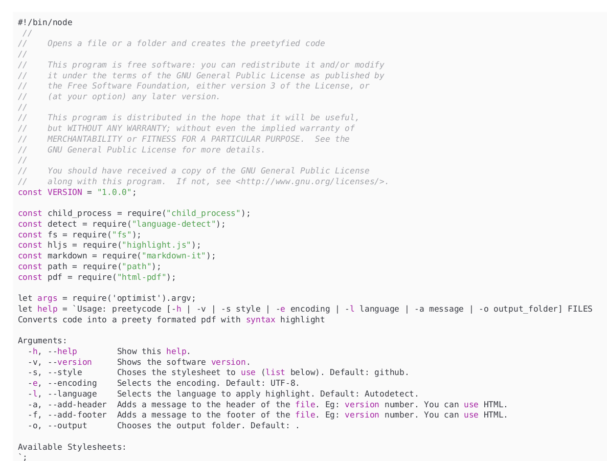

# prettycode
`prettycode` is a software to pretty print code into a `pdf` file.



```
Usage: prettycode [-h | -v | -s style | -e encoding | -l language | -a message | -o output_folder] FILES
Converts code into a pretty formated pdf with syntax highlight

Arguments:
  -h, --help        Show this help.
  -v, --version     Shows the software version.
  -s, --style       Choses the stylesheet to use (list below). Default: github.
  -e, --encoding    Selects the encoding. Default: UTF-8.
  -l, --language    Selects the language to apply highlight. Default: Autodetect.
  -a, --add-header  Adds a message to the header of the file. Eg: version number. You can use HTML.
  -f, --add-footer  Adds a message to the footer of the file. Eg: version number. You can use HTML.
  -o, --output      Chooses the output folder. Default: .
```

## Dependencies

* [node](https://nodejs.org/en/)
* [npm](https://www.npmjs.com/)

## Installation
Just install the node dependencies and you are good to go
```bash
git clone git@github.com:luxedo/prettycode.git
cd prettycode
npm install
```

## License
This program is free software: you can redistribute it and/or modify it under the terms of the GNU General Public License as published by the Free Software Foundation, either version 3 of the License, or (at your option) any later version.

This program is distributed in the hope that it will be useful, but WITHOUT ANY WARRANTY; without even the implied warranty of MERCHANTABILITY or FITNESS FOR A PARTICULAR PURPOSE.  See the GNU General Public License for more details.

You should have received a copy of the GNU General Public License along with this program.  If not, see <http://www.gnu.org/licenses/>.
