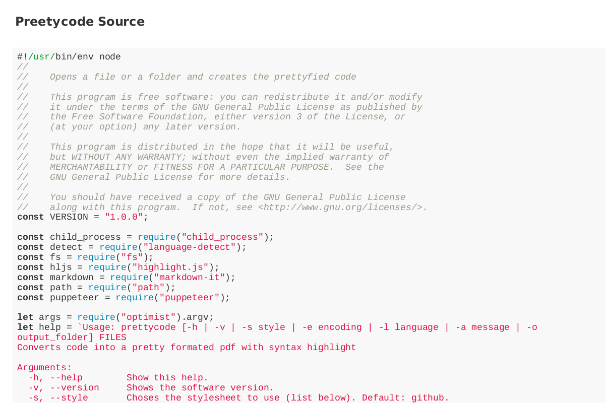

# prettycode
`prettycode` is a software to pretty print code into a `pdf` file. It has a library
and an executable:

## Installation
Clone the repo, install the node dependencies and you are good to go
```bash
git clone git@github.com:luxedo/prettycode.git
cd prettycode
npm install
./prettycode FILES
```
Or you can install via `npm`
```bash
npm install prettycode
```

## Usage
### `prettycode(fileName, [options])`
#### Options:
-   `style`: Choses the stylesheet to use (list below). Default: github.
-   `encoding`: Selects the encoding. Default: UTF-8.
-   `language`: Selects the language to apply highlight. Default: Autodetect.
-   `addHeader`: Adds a message to the header of the file. Eg: version number.
-   `addFooter`:  Adds a message to the footer of the file. Eg: version number.
-   `output`: Chooses the output folder. Default: `.`

Example:
```javascript
const pc = require("prettycode")

const opts = {
  style: "github",
  addHeader: "<h1>My Nice File</h1>"
}
pc("myFile.py", "myFile.py.pdf", opts)
.then(err => {
  if (err) throw err
  console.log("Done!");
})
```

The executable has the following options:
```
Usage: prettycode [-h | -v | -s style | -e encoding | -l language | -a message | -o output_folder] FILES
Converts code into a pretty formated pdf with syntax highlight

Arguments:
  -h, --help        Show this help.
  -v, --version     Shows the software version.
  -s, --style       Choses the stylesheet to use (list below). Default: github.
  -e, --encoding    Selects the encoding. Default: UTF-8.
  -l, --language    Selects the language to apply highlight. Default: Autodetect.
  -a, --add-header  Adds a message to the header of the file. Eg: version number. You can use HTML.
  -f, --add-footer  Adds a message to the footer of the file. Eg: version number. You can use HTML.
  -o, --output      Chooses the output folder. Default: .
```

Running the program passing itself as argument prints the source code:
```sh
$ prettycode -a "<b>Preetycode Source</b>" prettycode
```
or:
```javascript
const pc = require("prettycode");

const opts = {
  addHeader: "<b>Preetycode Source</b>"
};
pc("prettycode", opts)
.then(err => {
  if (err) throw err;
  console.log("Done!");
});
```
Generated `prettycode.pdf`:



## Avaliable Stylesheets
The styles used for rendering were taken from [highlight.js](https://highlightjs.org/).
Check their [demo](https://highlightjs.org/static/demo/) for examples.

-   a11y-dark
-   a11y-light
-   agate
-   an-old-hope
-   androidstudio
-   arduino-light
-   arta
-   ascetic
-   atelier-cave-dark
-   atelier-cave-light
-   atelier-dune-dark
-   atelier-dune-light
-   atelier-estuary-dark
-   atelier-estuary-light
-   atelier-forest-dark
-   atelier-forest-light
-   atelier-heath-dark
-   atelier-heath-light
-   atelier-lakeside-dark
-   atelier-lakeside-light
-   atelier-plateau-dark
-   atelier-plateau-light
-   atelier-savanna-dark
-   atelier-savanna-light
-   atelier-seaside-dark
-   atelier-seaside-light
-   atelier-sulphurpool-dark
-   atelier-sulphurpool-light
-   atom-one-dark-reasonable
-   atom-one-dark
-   atom-one-light
-   brown-paper
-   codepen-embed
-   color-brewer
-   darcula
-   dark
-   darkula
-   default
-   docco
-   dracula
-   far
-   foundation
-   github-gist
-   github
-   gml
-   googlecode
-   grayscale
-   gruvbox-dark
-   gruvbox-light
-   hopscotch
-   hybrid
-   idea
-   ir-black
-   isbl-editor-dark
-   isbl-editor-light
-   kimbie.dark
-   kimbie.light
-   lightfair
-   magula
-   mono-blue
-   monokai-sublime
-   monokai
-   nord
-   obsidian
-   ocean
-   paraiso-dark
-   paraiso-light
-   pojoaque
-   purebasic
-   qtcreator_dark
-   qtcreator_light
-   railscasts
-   rainbow
-   routeros
-   school-book
-   shades-of-purple
-   solarized-dark
-   solarized-light
-   sunburst
-   tomorrow-night-blue
-   tomorrow-night-bright
-   tomorrow-night-eighties
-   tomorrow-night
-   tomorrow
-   vs
-   vs2015
-   xcode
-   xt256
-   zenburn

## License
This program is free software: you can redistribute it and/or modify it under the terms of the GNU General Public License as published by the Free Software Foundation, either version 3 of the License, or (at your option) any later version.

This program is distributed in the hope that it will be useful, but WITHOUT ANY WARRANTY; without even the implied warranty of MERCHANTABILITY or FITNESS FOR A PARTICULAR PURPOSE.  See the GNU General Public License for more details.

You should have received a copy of the GNU General Public License along with this program.  If not, see <http://www.gnu.org/licenses/>.
